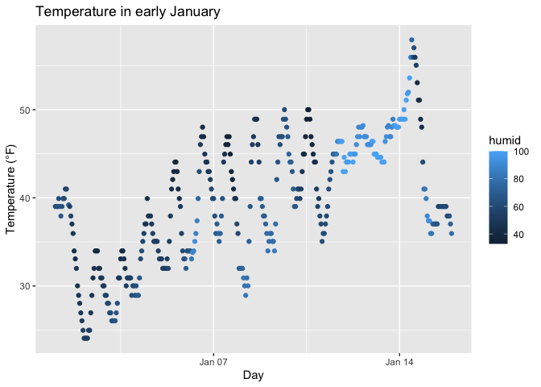

p8105_hw1_rk3445
================
Rosie Kwon

# Problem 1

``` r
library(tidyverse)
```

## load the `moderndive` library the dataset

``` r
library(moderndive)
data("early_january_weather")
```

## description of dataset

The `early_january_weather` dataset has 358 observations and 15
variables.

The variables include:

- `origin`: the source of observation data. Data are from EWR.

- `year`,`month`,`day`,`hour`,`time_hour` : Time of recording. The data
  cover the period from 2013-01-01 01:00 to 2013-01-15 23:00.

- `temp`: temperature in Fahrenheit, ranging from 24.08°F to 57.92°F,
  with a mean of 39.6°F.

- `dewp` : dewpoint in Fahrenheit

- `humid`: humidity, ranging from 32.86 to 100

- `wind_dir`,`wind_speed`,`wind_gust`: wind direction/speed/gust speed

- `precip`: precipitation

- `pressure`: pressure

- `visib`: visibility

These variables provide detailed information on weather conditions
during early January, allowing for the study of temperature variation,
humidity trends, and wind or precipitation patterns over time.

## scatter plot

``` r
ggplot(early_january_weather, aes(x = time_hour, y = temp)) + geom_point(aes(color = humid)) +labs(
    title = "Temperature in early January",
    x = "Day",
    y = "Temperature (°F)"
  )
```

<!-- -->

The scatter plot shows the temperature trends from January 1st to
January 15th. From early to mid-January, temperatures show a general
upward trend. Daily cycles can be seen with lower temperature at night
and higher temperature during the daytime, typically peaking around
noon. Brighter-colored points (indicating higher humidity) are more
frequently observed at lower temperatures. However, around mid-January,
there is a sudden spike in temperature, and some points at lower
temperatures show humidity close to 90–100%. In summary, early January
started cooler and drier, but by mid-January it became warmer and more
humid.

## save the plot as a pdf

``` r
ggsave("temperature.pdf")
```

    ## Saving 7 x 5 in image

# Problem 2

## create a data frame comprised of:

- a random sample of size 10 from a standard Normal distribution
- a logical vector indicating whether elements of the sample are greater
  than 0
- a character vector of length 10
- a factor vector of length 10, with 3 different factor “levels”

``` r
df = 
  tibble(
    numeric_var = rnorm(10),
    logical_var = numeric_var > 0,
    char_var = letters[1:10],
    factor_var = factor(sample(c("step1", "step2", "step3"), 10, replace = TRUE))
  )
```

## take the mean of each variable

- Method 1)

``` r
sapply(df, mean)
```

    ## Warning in mean.default(X[[i]], ...): argument is not numeric or logical:
    ## returning NA
    ## Warning in mean.default(X[[i]], ...): argument is not numeric or logical:
    ## returning NA

    ## numeric_var logical_var    char_var  factor_var 
    ##  -0.2284131   0.3000000          NA          NA

- Method 2)

Hint: for now, to take the mean of a variable in a dataframe, you need
to pull the variable out of the dataframe. Try loading the tidyverse and
using the pull function.

``` r
# Numeric variable
num <- df %>% pull(numeric_var)
mean(num)
```

    ## [1] -0.2284131

``` r
# Logical variable
logi <- df %>% pull(logical_var)
mean(logi)
```

    ## [1] 0.3

``` r
# Character variable
char <- df %>% pull(char_var)
mean(char)
```

    ## Warning in mean.default(char): argument is not numeric or logical: returning NA

    ## [1] NA

``` r
# Factor variable
fac <- df %>% pull(factor_var)
mean(fac)
```

    ## Warning in mean.default(fac): argument is not numeric or logical: returning NA

    ## [1] NA

## What works and what doesn’t?

A numeric vector can have its mean calculated. For a logical vector,
TRUE is treated as 1 and FALSE is treated as 0 , so `mean()` gives the
proportion of TRUE values. However, a character vector contains text, so
the mean cannot be calculated. Similarly, a factor vector is
categorical, so its mean cannot be calculated either.

## explicitly convert variables from one type to another

Write a code chunk that applies the as.numeric function to the logical,
character, and factor variables (please show this chunk but not the
output). What happens, and why? Does this help explain what happens when
you try to take the mean?

``` r
num_char <- mean(as.numeric(char))
```

    ## Warning in mean(as.numeric(char)): NAs introduced by coercion

``` r
num_log <- mean(as.numeric(logi))
num_fac <- mean(as.numeric(fac))
```

For character variables, coercing them to numeric produces a warning
because non-numeric strings cannot be converted, resulting in NA values
and an invalid mean. Converting logical values into numeric values gives
the proportion of TRUE values. For factor variables, numeric conversion
returns the integer assigned to each level. However, taking the mean of
these integer codes is not related to actual mean of the values. This
helps me to explain why mean() function behaves differently depending on
the variable type and it only works directly on numeric and logical
vectors.
